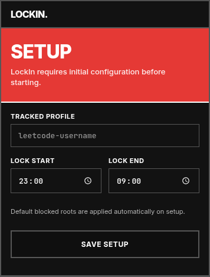
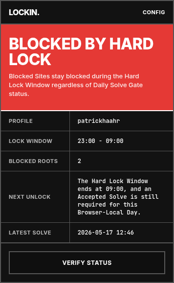
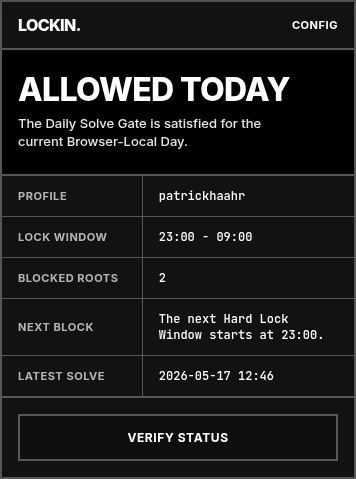
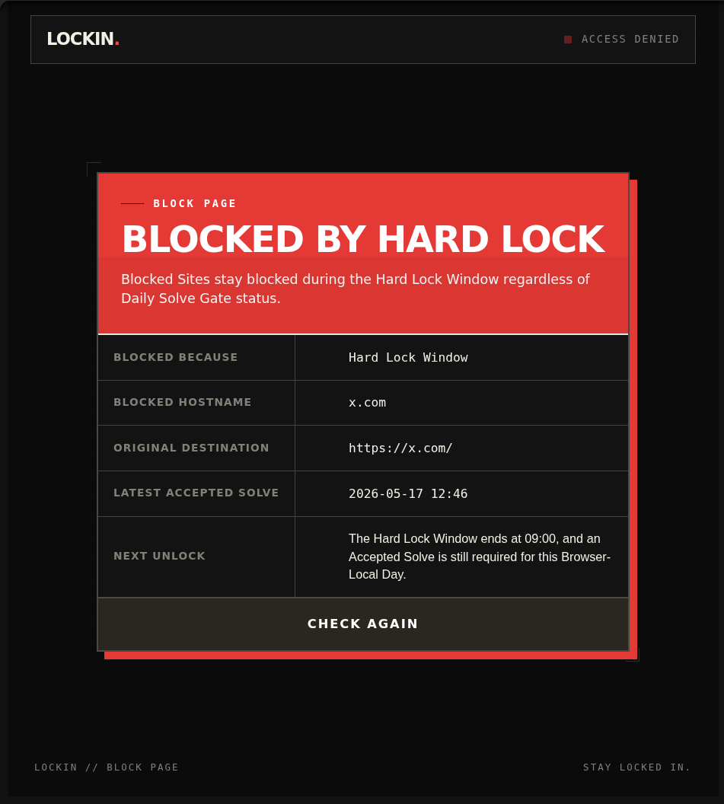
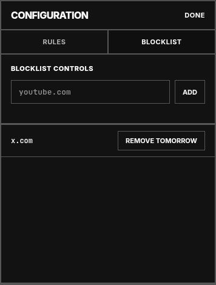
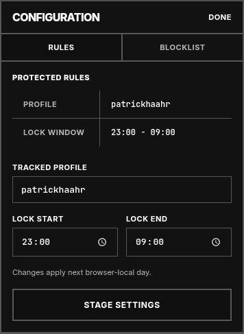

<h1 align="center">LOCKIN.</h1>
<p align="center">
  
</p>

<p align="center">
  <strong>Block distracting sites. The only way out? Solve a LeetCode problem. Solve first, scroll second.</strong>
</p>

## Screenshots

<table>
  <tr>
    <td align="center" width="33%">
      
      <br>
      <sub><em>Initial setup</em></sub>
    </td>
    <td align="center" width="33%">
      
      <br>
      <sub><em>Blocked state</em></sub>
    </td>
    <td align="center" width="33%">
      
      <br>
      <sub><em>Unlocked state</em></sub>
    </td>
  </tr>
  <tr>
    <td colspan="3" align="center">
      <strong>Popup States</strong> — the extension icon tells you at a glance whether you're locked or free to browse
    </td>
  </tr>
</table>

<br>

<table>
  <tr>
    <td align="center">
      
      <br>
      <sub><em>The block page preserves your original URL and explains exactly why access is denied</em></sub>
    </td>
  </tr>
  <tr>
    <td align="center">
      <strong>Block Page</strong> — full-page interception during the Hard Lock Window or when the Daily Solve Gate is closed
    </td>
  </tr>
</table>

<br>

<table>
  <tr>
    <td align="center" width="50%">
      
      <br>
      <sub><em>Manage blocked sites</em></sub>
    </td>
    <td align="center" width="50%">
      
      <br>
      <sub><em>Configure protection rules</em></sub>
    </td>
  </tr>
  <tr>
    <td colspan="2" align="center">
      <strong>Configuration</strong> — add domains with delayed removal protection and set your Hard Lock Window
    </td>
  </tr>
</table>

## What It Does

LockIn enforces a simple contract: if you want to browse distracting sites, you need to solve at least one LeetCode problem today. It combines two independent blocking rules:

### Hard Lock Window

A configurable time range (default: 11:00pm–9:00am) where all blocked sites are **completely inaccessible** regardless of your LeetCode activity. Use this to enforce sleep hygiene or create distraction-free focus blocks.

### Daily Solve Gate

Outside the hard lock window, blocked sites remain blocked until you've submitted at least one **accepted** LeetCode solution for the current day. Once you solve something, sites unlock immediately. The gate resets at local midnight every day.

**Example**: Solve a problem at 10:00am? Twitter unlocks at 10:01am (unless you're inside the hard lock window).

## How It Works

When you try to visit a blocked site:

1. **During hard lock hours**: The page is replaced with a block page explaining you're in the hard lock window
2. **Outside hard lock, no solve today**: The page is replaced with a block page showing your last accepted solve (if any) and when you'll unlock
3. **Outside hard lock, solved today**: The site loads normally

The block page preserves your original destination and automatically retries when conditions change—you don't lose your place.

## Installation

### From Source (Developer Mode)

1. Clone this repository
2. Install dependencies:
   ```bash
   pnpm install
   ```
3. Build the extension:
   ```bash
   pnpm build
   ```
4. Open Chrome and navigate to `chrome://extensions/`
5. Enable "Developer mode" in the top right
6. Click "Load unpacked" and select the `dist/` folder
7. The LockIn icon should appear in your toolbar

### First-Time Setup

Click the LockIn icon in your toolbar. On first run, you'll configure:

- **Tracked Profile**: Your LeetCode username (the extension checks this account for accepted submissions)
- **Hard Lock Window**: When sites are completely blocked (default: 23:00–09:00)

After saving, the extension immediately verifies your LeetCode profile. You're ready to go.

## Configuration

Click the LockIn icon and the settings gear to configure:

### Blocked Sites

- **Active**: Sites currently being blocked (default: twitter.com, x.com and subdomains)
- **Pending**: Sites scheduled for removal (takes effect tomorrow)
- Add sites by entering a domain (e.g., `youtube.com`) or full URL
- Removals are delayed until the next day to prevent bypassing

### Protected Settings

- **Tracked Profile**: Your LeetCode username
- **Hard Lock Window**: Start and end times for the hard lock

**Important**: These settings can only be changed **once per day** (first-run setup is exempt). Changes save immediately but take effect tomorrow. This prevents you from quickly swapping to an alt account or disabling the hard lock to bypass the system.

## How the Blocking Works

LockIn uses a content script that detects when you navigate to a blocked domain. Instead of redirecting (which Chrome MV3 doesn't reliably support), it replaces the page content in-place with the block page while keeping you on the original URL. This means:

- Your original destination is preserved for retry
- The page URL stays the same (no weird redirect loops)
- When unlocked, the page simply reloads to show the real content

The extension schedules alarms to check at:

- Hard lock start time
- Hard lock end time
- Local midnight (day boundary)

At each transition, it updates state and reevaluates open tabs.

## Anti-Bypass Measures

LockIn is designed to be annoying to bypass:

1. **Daily change limit**: Protected settings (username, hard lock window) can only be changed once per day
2. **Delayed removals**: Removing a blocked site doesn't take effect until tomorrow
3. **Local-first**: All state is stored locally; no server to hack
4. **Fail-closed**: If LeetCode can't be reached or your username is invalid, sites stay blocked

## FAQ

**Q: Does it count if I solve a problem I've solved before?**  
A: Yes! Any accepted submission today counts, even on previously-solved problems.

**Q: What if I solve a problem at 11:30pm?**  
A: It counts for today, but if your hard lock runs until 9:00am, you'll need to wait until then to browse. The daily gate resets at midnight.

**Q: Can I disable it temporarily?**  
A: No manual override exists by design. Solve a problem or wait for the hard lock to end.

**Q: Does it work with LeetCode alternatives?**  
A: Currently only LeetCode is supported.

**Q: Is my data sent anywhere?**  
A: No. Your LeetCode username and settings are stored locally. The extension only queries LeetCode's public GraphQL API to check your recent submissions.
